# Environment asset library

Measured and visually reviewed on 2026-10-01 in the Ink renderer worktree.
This catalog describes the eleven existing PNG atlases (44 indexed cells), not
future assets. Use the [stage inventory](stage-sprite-inventory.md) for proposed
families and scene mapping, and [stage art plan](stage-art-plan.md) for composition.
[Asset provenance](../../src/rendering/environment/assets/README.md) records sources.

## Shared style and reuse contract

Japanese ink illustration with angular silhouettes and broad faceted planes;
charcoal, warm gray and muted ivory, rough texture inside the art and transparent
exteriors. Keep final film grading downstream. Scenery is modular rather than a
single scene plate. Preserve sprite aspect; change placement, count and scale for
desktop/tablet layouts. Fog and low opacity soften joins but do not prove seamlessness.
The images below are original source sheets displayed as thumbnails, not newly
cropped or repainted copies. Follow their links for the full-resolution PNG.

Cell order throughout is **0 top-left, 1 top-right, 2 bottom-left, 3 bottom-right**.
Descriptions identify visible forms; they are not separate asset filenames.

## Measured dimensions and alpha

All eleven PNGs contain actual transparent pixels and variable alpha. The table's
transparent percentage counts pixels with alpha exactly zero; partial alpha includes
both near-opaque interiors and feathered edges. Seam V/H reports maximum alpha on
the two pixel columns/rows adjacent to the sheet midpoint, on a 0-255 scale.
A high value flags artwork near/across a cut, not a runtime screenshot failure.
Measurements use decoded RGBA pixels, not the preview background color.

| ID | Sheet | Dimensions (px) | Fully transparent | Seam V / H alpha |
| --- | --- | --- | --- | --- |
| E01 | [mountain-atlas.png](../../src/rendering/environment/assets/mountain-atlas.png) | 1774 x 887 | 69.7% | 1 / 1 |
| E02 | [pine-atlas.png](../../src/rendering/environment/assets/pine-atlas.png) | 1254 x 1254 | 65.1% | 252 / 1 |
| E03 | [bamboo-atlas.png](../../src/rendering/environment/assets/bamboo-atlas.png) | 1254 x 1254 | 55.5% | 1 / 1 |
| E04 | [field-banks-atlas.png](../../src/rendering/environment/assets/field-banks-atlas.png) | 1774 x 887 | 68.2% | 11 / 11 |
| E05 | [shrubs-atlas.png](../../src/rendering/environment/assets/shrubs-atlas.png) | 1254 x 1254 | 72.6% | 1 / 1 |
| E06 | [field-rocks-atlas.png](../../src/rendering/environment/assets/field-rocks-atlas.png) | 1774 x 887 | 74.9% | 3 / 16 |
| E07 | [foreground-boulders-atlas.png](../../src/rendering/environment/assets/foreground-boulders-atlas.png) | 1774 x 887 | 67.9% | 1 / 0 |
| E08 | [grass-edges-atlas.png](../../src/rendering/environment/assets/grass-edges-atlas.png) | 1774 x 887 | 76.6% | 1 / 1 |
| E09 | [meadow-patches-atlas.png](../../src/rendering/environment/assets/meadow-patches-atlas.png) | 1774 x 887 | 57.2% | 6 / 252 |
| E10 | [fog-wisps-atlas.png](../../src/rendering/environment/assets/fog-wisps-atlas.png) | 1774 x 887 | 73.0% | 2 / 249 |
| E11 | [rocks-atlas.png](../../src/rendering/environment/assets/rocks-atlas.png) | 1254 x 1254 | 78.5% | 1 / 0 |

### Current frame rectangles and anchors

For every atlas except E07, current helpers use `sw = image.width / 2` and
`sh = image.height / 2`. Cell `i` samples `(x, y, width, height)` =
`((i % 2) * sw, floor(i / 2) * sh, sw, sh)`, measured from image top-left.
Square sheets therefore use 627 x 627 cells. Wide sheets use 887 x **443.5**
source rectangles, including a fractional y origin for their bottom row.
This documents current Canvas sampling; it is not an integer packing specification.

For a future integer-packed export, define explicit rectangles and sufficient
gutters, then update the consumer and inspect boundary pixels. A simple 443/444
split avoids fractional geometry but does not fix existing artwork crossover.
Do not silently trim transparent padding or change these originals.

Current composition anchors (normalized frame-local x/y, unless stated otherwise):

| Consumer | Assets | Anchor | Current usage |
| --- | --- | --- | --- |
| [index.ts](../../src/rendering/environment/index.ts), `stamp` | E02/E03/E11 | (0.5, 1.0) | Entire cell bottom at the requested foot; visible object feet may sit above it |
| [mountains.ts](../../src/rendering/environment/mountains.ts) | E01 | (0.5, 0.92) | Three rows; spacing 72% of tile width, fog recolor and base dissolve |
| [midground.ts](../../src/rendering/environment/midground.ts) | E04/E06 | (0.5, 0.92) | Low-opacity bank/stone placement behind combat ground |
| midground.ts | E05 | (0.5, 0.87) | Small shrubs with local placement offsets |
| [meadow.ts](../../src/rendering/environment/meadow.ts) | E08/E09/E10 | (0.5, 0.9) | Ground patches/fringes and low-opacity drifting fog |

These anchors are placement choices in those consumers, **not universal pivots**
for each image. New compositions may choose different ground contact after inspection.
Horizontal mirroring is used by those helpers; asymmetric lighting makes it an art
tradeoff. Rotation and nonuniform stretch are not established reuse conventions.
Fog is source-over at roughly 0.10-0.14 opacity in the field; reduced-motion,
reduced-flash and low-quality settings freeze its drift.

E07 has explicit integer frames and frame-local pixel anchors in
[foreground.ts](../../src/rendering/environment/foreground.ts):

| Cell / name | Source rectangle x,y,w,h (px) | Anchor x,y (px) |
| --- | --- | --- |
| 0 fractured | 0,0,887,443 | 443.5,423 |
| 1 split-slab | 887,0,887,443 | 443.5,423 |
| 2 sloped-wedge | 0,443,887,444 | 443.5,363 |
| 3 compact-crag | 887,443,887,444 | 443.5,377 |

Field placement caches two E07 sprites into the ground base, preserves native aspect,
and does not mirror or rotate them. The original static and live grass remain.

## Visual catalog

### E01 - Mountain ridges

<a href="../../src/rendering/environment/assets/mountain-atlas.png">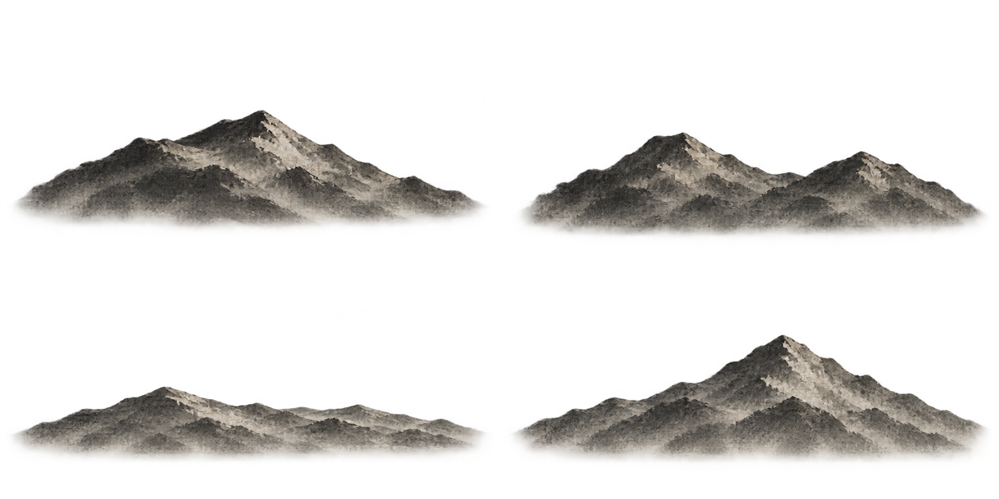</a>

| Cell | Visible variation |
| --- | --- |
| 0 - top-left | Broad ridge with a central high summit |
| 1 - top-right | Twin peaks with a shallow saddle |
| 2 - bottom-left | Low extended rolling ridge |
| 3 - bottom-right | Steep triangular summit over lower foothills |

Distance, valleys, passes and far coastal headlands. Base mist is already painted in; use overlapping placement and additional fog, not seamless tiling. Do not enlarge as a near cliff.

### E02 - Windswept pines

<a href="../../src/rendering/environment/assets/pine-atlas.png">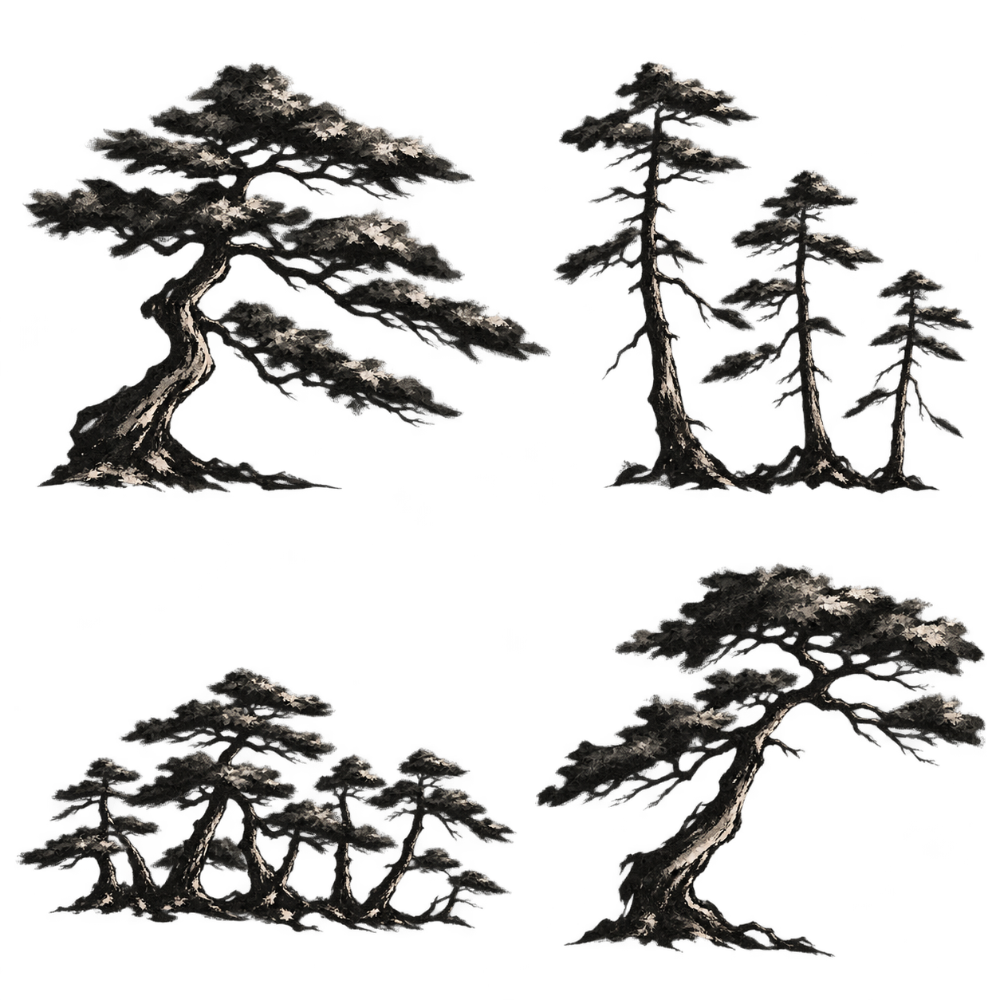</a>

| Cell | Visible variation |
| --- | --- |
| 0 - top-left | Large bent trunk with broad tiered crown |
| 1 - top-right | Three tall narrow trees of descending height |
| 2 - bottom-left | Low grove of several short trees |
| 3 - bottom-right | Single leaning trunk with a rounded asymmetric crown |

Sparse groves, skyline landmarks, coastal trees. Cell 0 canopy reaches the central vertical division; crops may truncate branches or include a fragment in cell 1. Inspect any large near-camera reuse.

### E03 - Bamboo clumps

<a href="../../src/rendering/environment/assets/bamboo-atlas.png">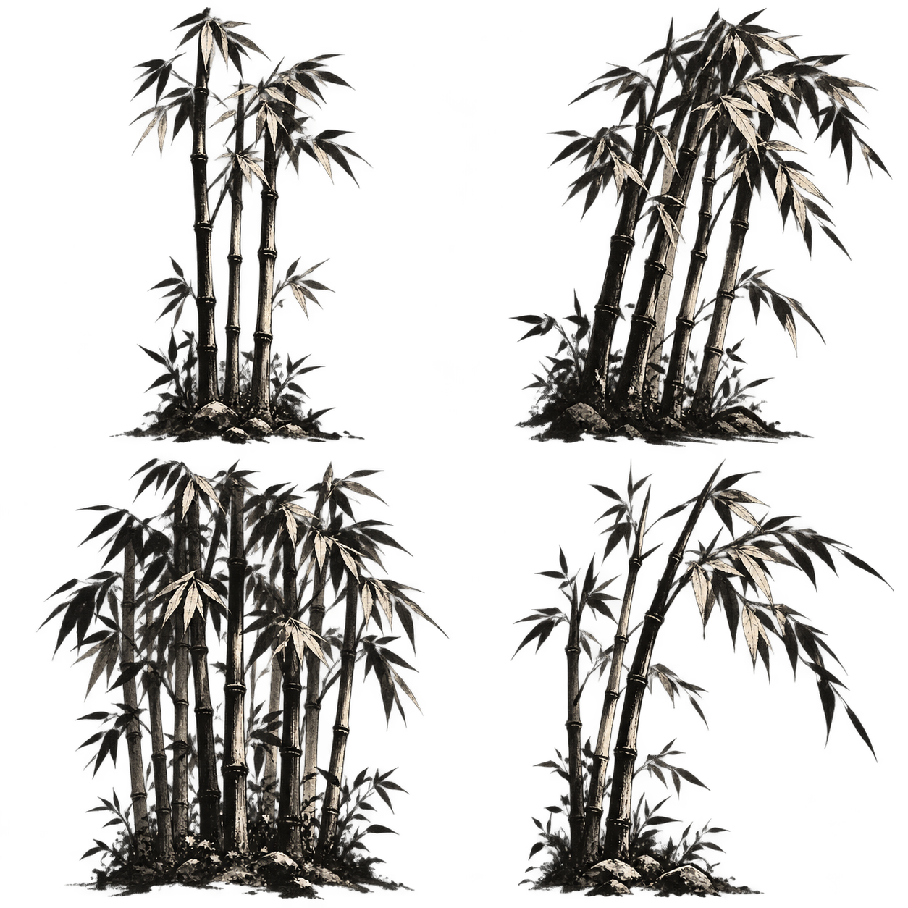</a>

| Cell | Visible variation |
| --- | --- |
| 0 - top-left | Narrow upright culms with open leaves |
| 1 - top-right | Dense leaning clump with a broad crown |
| 2 - bottom-left | Dense upright grove with staggered culms |
| 3 - bottom-right | Sparse diagonally leaning stems and long rightward leaves |

Road-edge framing or distant groves. Includes stones and ground at the roots; cannot be treated as separate bare stems. Upper foliage is close to sheet edges.

### E04 - Earth banks

<a href="../../src/rendering/environment/assets/field-banks-atlas.png">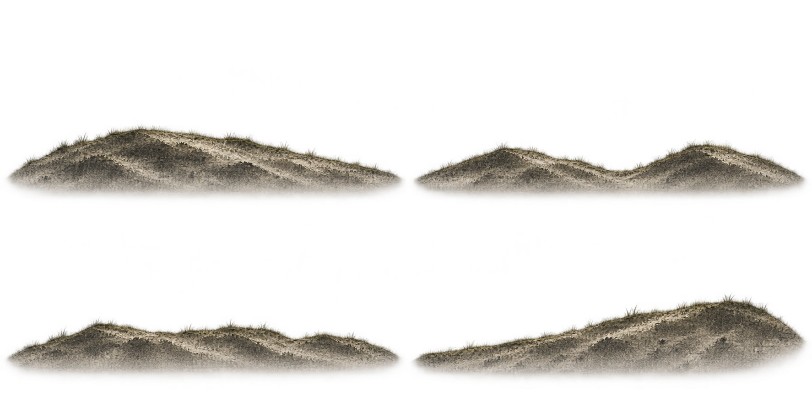</a>

| Cell | Visible variation |
| --- | --- |
| 0 - top-left | Broad rounded hill sloping down to the right |
| 1 - top-right | Two low mounds with a shallow central dip |
| 2 - bottom-left | Long low bank with several shallow rises |
| 3 - bottom-right | Low left approach rising to a right-hand shoulder |

Rolling midground, path borders and hillside bases. Pale base haze is baked in and side margins are tight. Not a connector system or seamless strip; use terrain occlusion or subdued opacity.

### E05 - Shrubs

<a href="../../src/rendering/environment/assets/shrubs-atlas.png">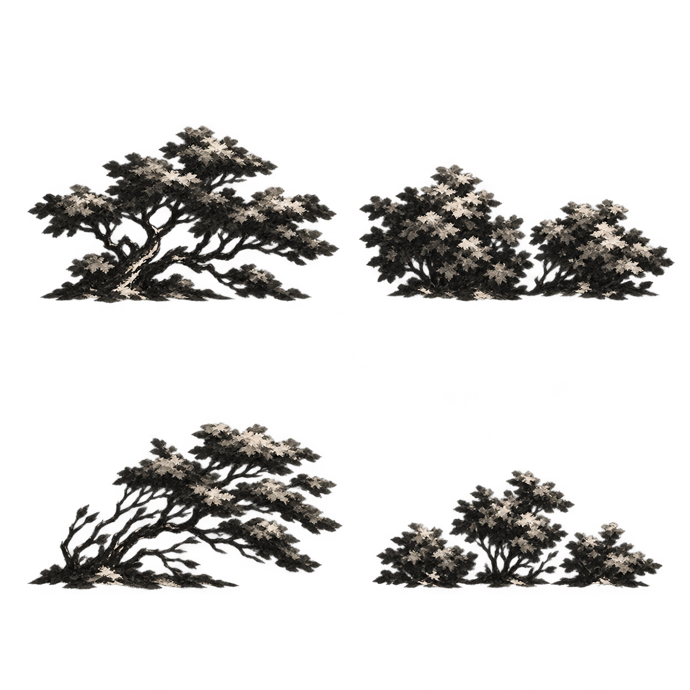</a>

| Cell | Visible variation |
| --- | --- |
| 0 - top-left | Spreading woody shrub with exposed curving trunk |
| 1 - top-right | Two dense bushes, taller on the left |
| 2 - bottom-left | Strongly wind-swept leaning woody shrub |
| 3 - bottom-right | Low three-part cluster with taller central foliage |

Sparse undergrowth and silhouette breakup. Some variants resemble small trees; choose by silhouette rather than a fixed botanical identity. Baked ground at feet.

### E06 - Low rock clusters

<a href="../../src/rendering/environment/assets/field-rocks-atlas.png">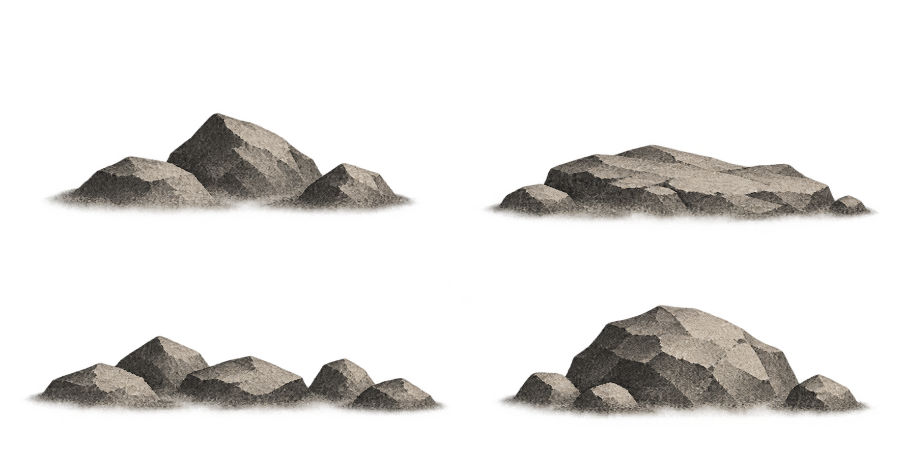</a>

| Cell | Visible variation |
| --- | --- |
| 0 - top-left | Three main rocks with a tall central triangular stone |
| 1 - top-right | Long low fractured shelf |
| 2 - bottom-left | Scattered chain of small angular stones |
| 3 - bottom-right | Large central crag flanked by small rocks |

Midground stones, path margins and distant rubble. Soft pale ground contact is baked in; E07 suits stronger foreground shapes. Not masonry or water-reflection art.

### E07 - Foreground boulders

<a href="../../src/rendering/environment/assets/foreground-boulders-atlas.png">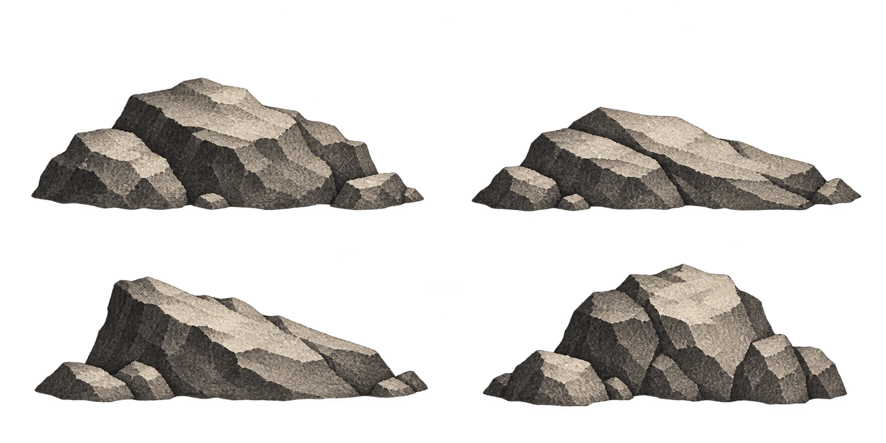</a>

| Cell | Visible variation |
| --- | --- |
| 0 - top-left | Broad fractured boulder with attached smaller blocks |
| 1 - top-right | Long split slab with a diagonal top |
| 2 - bottom-left | Sloped wedge with small stones at the left foot |
| 3 - bottom-right | Compact tall crag with blocky foothold stones |

Foreground anchors and ridge edges. Firmer facets than E06; common upper-left lighting. Current field uses cells 1 then 0. Full original sheet is preserved; use explicit frames below.

### E08 - Grass fringes

<a href="../../src/rendering/environment/assets/grass-edges-atlas.png">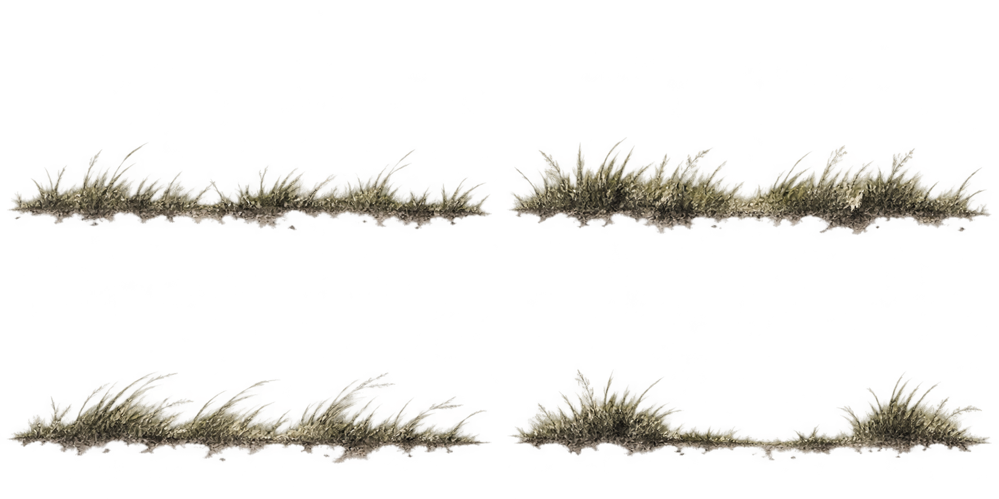</a>

| Cell | Visible variation |
| --- | --- |
| 0 - top-left | Broken low fringe with isolated taller blades |
| 1 - top-right | Dense uneven fringe with two main tufts |
| 2 - bottom-left | Long wind-bent grass leaning right |
| 3 - bottom-right | Two tufts separated by a low bare center |

Meadow transitions, path borders, isolated edge accents. Static cutouts supplement existing procedural animated grass; not a replacement for it or seamless repeat.

### E09 - Flattened meadow patches

<a href="../../src/rendering/environment/assets/meadow-patches-atlas.png">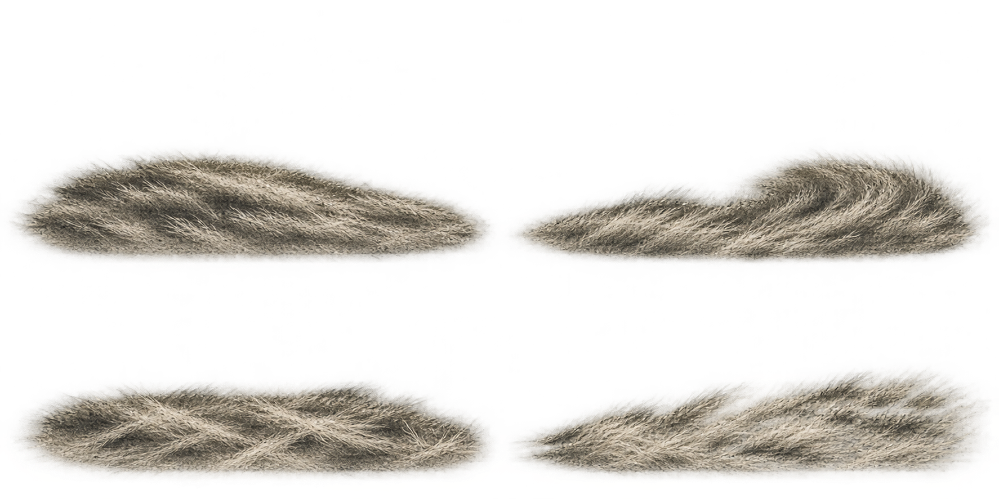</a>

| Cell | Visible variation |
| --- | --- |
| 0 - top-left | Broad shallow oval of bent interwoven grass |
| 1 - top-right | Swept curved patch rising toward the right |
| 2 - bottom-left | Low tangled mat with crossed straw strokes |
| 3 - bottom-right | Long flatter mat with diagonally aligned blades |

Subtle ground texture with low opacity. Top-row artwork crosses the horizontal division: current half-cell sampling clips it and may expose fragments in bottom cells. Avoid enlarging without inspecting a new crop contract.

### E10 - Fog wisps

<a href="../../src/rendering/environment/assets/fog-wisps-atlas.png">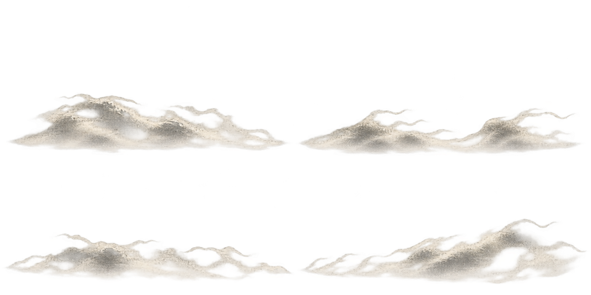</a>

| Cell | Visible variation |
| --- | --- |
| 0 - top-left | Broad dense billow with higher left/central mass |
| 1 - top-right | Low elongated wisp with curling tips and a central gap |
| 2 - bottom-left | Thin broken wisp with looping holes |
| 3 - bottom-right | Ascending diagonal plume with a higher right end |

Low drifting haze and valley atmosphere. Many interior pixels approach opaque, so runtime low opacity matters. Top artwork crosses the horizontal division; current cells are not fully isolated. Not ordered animation frames, physically fitted spray, or guaranteed smoke.

### E11 - Legacy mixed rocks and grass

<a href="../../src/rendering/environment/assets/rocks-atlas.png">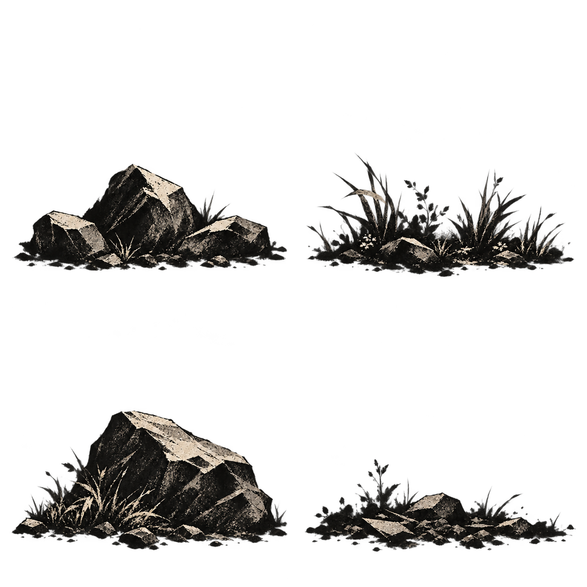</a>

| Cell | Visible variation |
| --- | --- |
| 0 - top-left | Three high-contrast rocks with small foot vegetation |
| 1 - top-right | Grass and leafy tufts around a low central stone |
| 2 - bottom-left | Large sloping boulder with grass at its feet |
| 3 - bottom-right | Low scattered rubble with sparse plants |

Prototype bamboo foreground/supporting props. More contrast and attached vegetation than E06/E07. Prefer newer separate families when independent grass/rock placement is needed.

## Reuse before new production

The Whispering Field is the established E01/E02/E04-E10 composition. Last Light
Ridge reuses five families through [ridge.ts](../../src/rendering/environment/ridge.ts):

| Existing cells | Ridge role |
| --- | --- |
| E01 cell 2 | Subdued faceted texture clipped inside the descending ridge silhouette |
| E04 cell 3, mirrored | Left hillside bank falling toward the open valley |
| E02 cells 3 and 2 | Leaning tree and smaller grove on the left slope |
| E05 cell 2; cell 0 outside low-quality mode | Wind-swept shrub and sparse low accent |
| E06 cell 2; cell 1 outside low-quality mode | Left foreground stones and small slope shelf |

Ridge's sprite helper uses the same fractional half-cell source rectangles with
normalized anchor (0.5, 0.94). This is a separate composition choice. Procedural
sky, sun disc, ridge silhouette, terrain, grass and valley haze supply the rest;
no new PNG family is required for this pass. It does not stamp the field's meadow,
grass-edge, fog-wisp or foreground-boulder kit automatically.
E03/E11 remain the separate bamboo/prototype kit. See the stage inventory for
future scene suggestions; suggested use is not evidence of integration.

When adding an asset, append a measured entry here with a source preview, visible
cell descriptions, actual rectangles, intended depth, alpha/gutter observations,
consumer-specific anchors, transform restrictions and provenance. Keep generated
originals. Snow, wetness and other derived artwork must identify its source cell
and preserve registration if it is intended as an overlay. These sheets provide
style references for future limbs/weapons but do not define rig or grip geometry.

Ridge ground props now fade through their lower 30% toward transparent ground contact.
During cached composition, midground props rotate around their anchors to follow
the local hillside slope (capped at about 10 degrees); foreground edge rocks stay
level. This is a renderer treatment, not a change to the source atlases.
